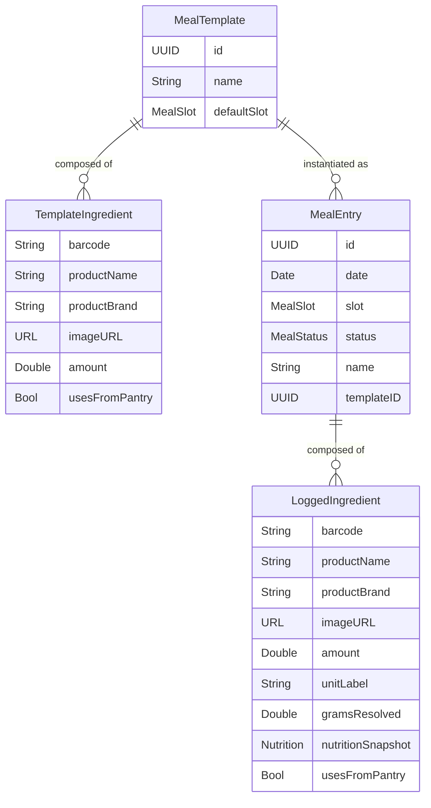
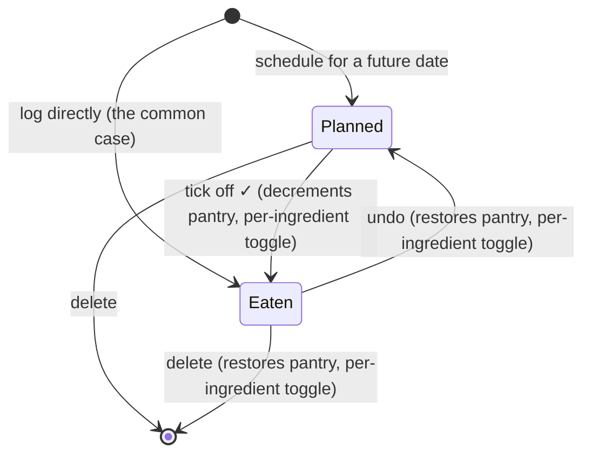
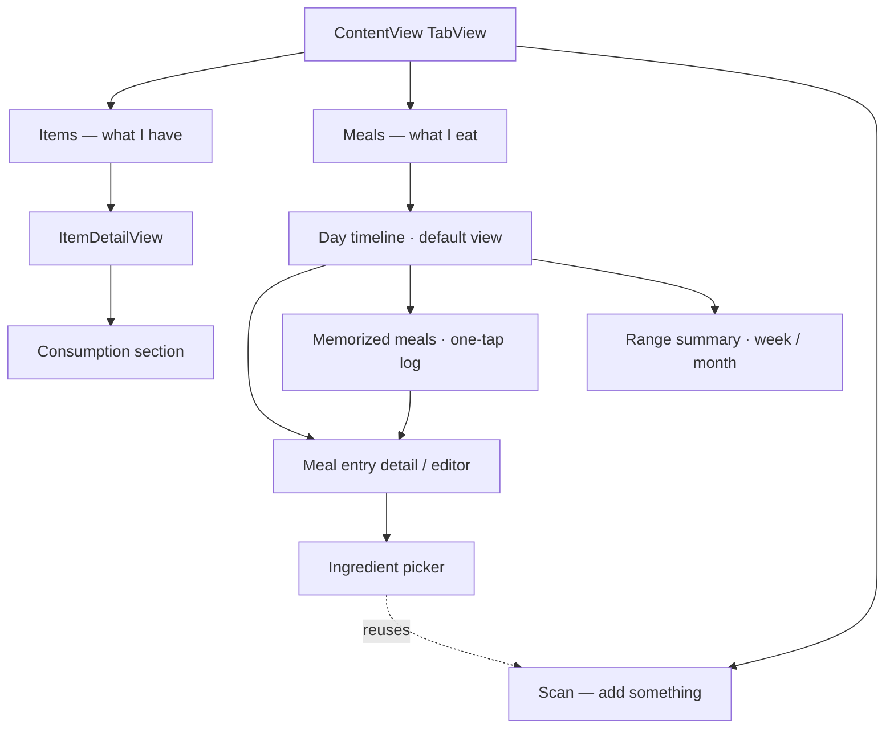

# Foodpoint — Meals Feature Design

**Status:** design decisions locked (2026-08-16) — ready to move into
implementation. Open items and their resolutions are in §12.
**Companion documents:** [design-brief.md](design-brief.md) — current-state
audit of the app; [package-architecture.md](package-architecture.md) — the
package split (`FoodFoundation`/`PantryKit`/`MealKit`/`FoodpointKit`) this
feature is built into, including why MealKit has no dependency on PantryKit
at all and how ingredients without a barcode get added (§3.2 and §6 below
build on that).

---

## 1. The core idea

Foodpoint today tracks **what you have**. It has no concept of **what you
eat**. Meals is not a food diary bolted onto a pantry app — it's the missing
verb that makes the pantry worth maintaining.

Right now, `setQuantity` is entirely manual: the user must remember to open an
item and decrement it after eating. Nobody does that reliably, so the
inventory drifts out of sync with reality and stops being trustworthy. Meals
close that loop: **logging a meal is what decrements the pantry.** The user
records something they'd want to record anyway (what they ate), and inventory
accuracy falls out as a side effect rather than being a chore.

That reframing should drive the design. Every interaction decision below
optimizes for *"logging what I ate is fast enough that I actually do it"* —
because if logging is skipped, both features degrade at once.

## 2. What this must support

Five capabilities were named as the bare level. Each maps to a section below:

| # | Capability | Where it's designed |
|---|---|---|
| 1 | Take items to construct meals | §6 Meal composition |
| 2 | Aggregate meals to evaluate nutrition of a timespan | §8 Nutrition aggregation |
| 3 | Memorize meals for easy ticking off | §7 Templates and one-tap logging |
| 4 | Plan meals that haven't happened yet | §5 Entry lifecycle |
| 5 | Track which products the user consumes | §9 Consumption tracking |
| 6 | Add ingredients that have no barcode to scan (produce, generic foods) | §6.4 Adding ingredients without a barcode |

## 3. Hard prerequisites

Two things must be resolved before meals can ship in any form. Both are
structural.

### 3.1 Persistence (owned separately)

`AppState` is a plain in-memory `@Observable` singleton — nothing is written
to disk anywhere in the app. Today that's survivable: force-quitting loses
your pantry, which is annoying but re-scannable in a few minutes.

**Meals make that unacceptable.** A nutrition history that evaporates on
restart isn't a degraded feature, it's a non-feature — "aggregate nutrition
over a timespan" is definitionally a claim about durable data. There is no
version of this feature that works without persistence.

**Decision:** persistence is being handled as its own piece of work, outside
this design (§12 #1). This document doesn't scope that work. What it does
commit to: every meals model type is a plain, `Codable`-friendly value type
with no behavior tied to being in memory, so the persistence work can adopt
`MealTemplate`, `MealEntry`, and friends the same way it'll adopt `FoodItem`
and `ProductUnit`, without a meals-specific storage layer.

### 3.2 A product catalog that outlives the pantry *(superseded — see below)*

This section originally proposed a shared `products: [String: Product]`
catalog on `AppState` so meal history survives a pantry item being fully
consumed. That approach assumed Meal and Pantry logic would share state,
which package-architecture.md's later decision rules out — PantryKit and
MealKit are independent packages that don't share a cache with each other
at all.

**Current answer:** `MealTemplate`/`MealEntry` ingredients snapshot the
product identity they need (name, brand, image) directly, at the moment
an ingredient is added — see §4.3 and package-architecture.md §3.4/§4.1.
No shared catalog exists or is needed; MealKit is self-sufficient for its
own history.

## 4. Concepts and data model

Four new types. Everything lives in `MealKit` (package-architecture.md
§3.4), keyed by barcode wherever it touches products, consistent with the
rest of the model — but **not referencing `PantryKit` in any way**.
Ingredients carry their own copy of the product data they need to display
themselves, rather than looking it up from anywhere else at render time.



`barcode`/`productName`/`productBrand`/`imageURL` are captured once, at the
moment the ingredient is added — via `FoodFoundation.ProductLookup`, called
directly by MealKit itself (package-architecture.md §3.4/§6), regardless of
whether the product also happens to be sitting in the pantry. There is no
reference to `Product`/`FoodItem` types here on purpose: MealKit owns a
self-sufficient copy, not a pointer into PantryKit's world.

### 4.1 `MealTemplate` — a memorized meal

A named, reusable composition: *"Morning Toast = 2 slices bread + 1 egg."*
Holds no date and no history. `TemplateIngredient` caches just enough
(`productName`/`productBrand`) to render the templates list instantly and
offline — but deliberately holds **no nutrition data**. Nutrition is
resolved fresh, via `FoodFoundation.ProductLookup.fetch`, at the moment a
template is turned into a `MealEntry` (§4.3) — that's what makes a template
a live recipe rather than a record: if you've since corrected the bread's
nutrition data, the next time you log "Morning Toast" reflects it.

The cost of this is a network round trip per ingredient every time a
template gets logged, same as re-scanning a barcode does today — consistent
with how the rest of the app already behaves, not a new tradeoff introduced
by meals.

### 4.2 `MealEntry` — a planned or eaten occurrence

One row on the timeline. Carries a date, a slot, a status, and its own copy
of the ingredients. Optionally remembers the `templateID` it came from, which
makes "you've eaten this 14 times" possible without string-matching names.

### 4.3 `LoggedIngredient` — a frozen line item

The important distinction from `TemplateIngredient`: once a meal is **eaten**,
its nutrition should stop moving. If the user later corrects a product's
nutrition data or renames its unit, last month's totals must not silently
change underneath them — a diary that rewrites its own history is worse than
no diary.

So logging an ingredient — whether typed in directly or instantiated from a
template — calls `FoodFoundation.ProductLookup.fetch` (or `.search` result
selection, §6.4) once and freezes everything it returns onto the
`LoggedIngredient`: `productName`, `productBrand`, `gramsResolved`, and
`nutritionSnapshot`. Planned entries resolve the same way but are expected
to be refreshed if edited before the date arrives, since they haven't
happened yet and *should* reflect current data up to that point.

This is a real philosophical split from existing behavior — `syncItemNutrition`
currently pushes changes into the live item on purpose — and it's worth being
explicit about it: **pantry state is live, history is frozen.** It's also
why MealKit never needs to ask PantryKit or any shared cache for a product's
current name or nutrition: by the time anything is displayed, it was already
captured at the moment that mattered.

### 4.4 `usesFromPantry` — decoupling nutrition from inventory

Every ingredient row, on both templates and logged entries, carries a
**"Use from pantry" toggle, on by default** (§12 #6). It answers one
question: *does eating this decrement my tracked inventory?*

This single flag resolves two separate problems at once:

- **Insufficient stock.** If a meal calls for more than the pantry currently
  holds, the user isn't blocked and doesn't have to fix the pantry number
  first — they can just flip the toggle off for that ingredient and log the
  meal as eaten. When the toggle stays on and stock is insufficient, the
  item still clamps to zero rather than going negative, with a soft inline
  note — the same non-blocking behavior as before, now just one of two ways
  to handle the situation instead of the only one.
- **Take-out and other non-pantry-sourced food.** A recognized barcode
  product (say, a snack you know well) eaten somewhere other than from your
  own stock — a friend's place, a store sample, food that was never in your
  pantry to begin with — can still be logged for nutrition and consumption
  history with the toggle off, without falsely implying it came out of your
  shelf.

Nutrition and consumption tracking (§8, §9) count every logged ingredient
**regardless of this toggle** — it only gates the pantry-quantity side
effect, never whether something counts as eaten. A `TemplateIngredient`
carries its own default for the flag (e.g. a template built around "my own
eggs" defaults on; one built around a café order defaults off), which seeds
— but doesn't lock — the `LoggedIngredient`'s value each time it's used.

This doesn't reopen the barcode-only question (§11): the ingredient still
has to be a known product either way. It just decouples *logging that you
ate it* from *claiming it came out of your pantry*.

### 4.5 `MealSlot` and `MealStatus`

```swift
enum MealSlot   { case breakfast, lunch, dinner, snack }
enum MealStatus { case planned, eaten }
```

`MealSlot` is a lightweight grouping for the day view, defaulted from the
current time of day so it costs the user nothing. It is deliberately a fixed
enum, not user-defined categories — this app's convention is to avoid
speculative configurability, and a custom-slot system earns its complexity
only if someone asks for it.

### 4.6 The nutrition math is already written

Because `ProductUnit` normalizes both tracking modes to a grams-per-unit
figure (weight mode simply has `gramsPerUnit == 1`), a single formula covers
every ingredient:

```
grams   = amount × unit.gramsPerUnit
contrib = nutrition.scaled(by: grams / 100)
```

`Nutrition.scaled(by:)` already exists and is unit-tested. Aggregation is
summing those contributions. No new math primitives are needed.

## 5. Entry lifecycle

Planning and logging are **the same object in different states**, not two
parallel systems. This is the design's main simplifying move: one timeline,
one editor, one aggregation path.



**Only the `.eaten` transition touches the pantry, and only for ingredients
with "Use from pantry" on** (§4.4). Planning something for Thursday must not
make Thursday's eggs disappear today; an ingredient logged with the toggle
off never touches inventory at any point in this diagram.

Undo matters more than usual here, because ticking off has an invisible side
effect on inventory. A mis-tap that silently eats four eggs and offers no way
back would make users distrust the whole loop.

## 6. Meal composition — building a meal from items

The editor is a list of ingredient rows plus a running nutrition footer.

### 6.1 Ingredient sources

Four sources, in order of expected use — and a clean split in where each
one is implemented, per package-architecture.md §3.4:

1. **From the pantry** — a picker over current pantry items, showing each
   product's remaining quantity. The default and fastest path for most
   meals. This is the one source MealKit can't provide on its own — it's
   composed at the app/FoodpointKit layer, which is the only place that can
   see both `pantry` and `meals` at once (package-architecture.md §3.5).
   Picking one hands MealKit a resolved product + barcode; MealKit itself
   still has no idea PantryKit exists.
2. **From history** — recently used ingredients, including ones no longer
   in the pantry. Purely a MealKit concern: it's just reading its own past
   `TemplateIngredient`/`LoggedIngredient` records (§4), no lookup needed.
3. **Scan** — reuses the existing camera flow; calls
   `FoodFoundation.ProductLookup.fetch(barcode:)` directly. MealKit's own
   capability, independent of PantryKit's scanner.
4. **Search** — new (§6.4): find something by name when there's no barcode
   to scan. Also MealKit's own capability, via
   `FoodFoundation.ProductLookup.search(query:)`.

### 6.2 Amount and the pantry toggle

Each ingredient row takes an **amount in that product's own unit** — "2
slices", "150 g" — reusing the exact label the user already configured for
that barcode. No new unit vocabulary is introduced, and the numeric fields
must use `String.localizedDouble` like everywhere else in the app.

Each row also carries the **"Use from pantry" toggle** (§4.4), on by
default, so the common case (this really did come out of my stock) needs no
interaction at all — it only needs attention for the exceptions.

The footer shows the running total with an explicit completeness signal (§8.2).

### 6.3 Products without an existing unit configuration

Ingredients sourced via scan or search (6.1 #3/#4) may be barcodes MealKit
has never seen before — there's no `ProductUnit` to reuse, since that
configuration lives in PantryKit and MealKit doesn't reach into it (nor
should it assume one exists just because the same barcode happens to be
configured in the pantry). For a first-time ingredient, MealKit asks the
same minimal question `ScannerView`'s new-product flow asks today — how is
this counted, weight or count, and what's the label — scoped to this
ingredient only, not written back anywhere PantryKit would see it. If the
same barcode is later scanned into the pantry too, that's a fully separate,
independently-configured `ProductUnit` — the duplication is the accepted
cost from package-architecture.md §4.1.

### 6.4 Adding ingredients without a barcode

Produce and other unlabeled groceries often have no barcode to scan at all,
which was the pantry app's hardest limitation carried straight into meals
(§11). **Search** (6.1 #4) is the fix: type a name, get a list of Open Food
Facts matches (name, brand, thumbnail) via
`FoodFoundation.ProductLookup.search(query:)`, pick one, and it flows into
the ingredient row exactly like a scanned result would — same unit setup
(6.3), same nutrition handling, same everything downstream. No new model
shape, no "estimated" marker, because this is still real Open Food Facts
data, just found a different way.

This is still bounded by Open Food Facts actually having an entry — a
truly home-cooked dish remains out of reach, which is what the still-deferred
quick-entry escape hatch (§11) is for. Search closes the produce-shaped gap;
it doesn't close the "nothing in OFF at all" gap.

## 7. Templates and one-tap logging

This is the interaction that determines whether the feature succeeds. If
logging your usual breakfast takes six taps, it won't happen.

**The fast path is one tap.** The Meals tab surfaces memorized meals directly
— tap one, and it's logged to today at the current slot, pantry decremented,
done. Full editing is available but never required.

Templates get created two ways:

- **Explicitly**, from a "New Meal" editor.
- **Promoted from something already logged** — after logging an ad-hoc meal,
  offer *"Remember this meal?"* with a name field.

The second path is the important one, and it's a pattern this app already
uses. `ScannerView` does exactly this for package sizes today: when a scanned
size isn't recognized, it asks whether to remember it as a named variant or
use it just this once. **Meals should reuse that interaction verbatim** —
same prompt shape, same "Save / Just This Once / Cancel" choice. Users who've
used the scanner will already know what it means, and it means the memorized
list fills up as a byproduct of normal use instead of requiring upfront
curation.

## 8. Nutrition aggregation over a timespan

### 8.1 Two scopes

- **Day** — the default view. Totals for the seven tracked nutrients across
  every `.eaten` entry that day, with planned entries shown separately as a
  projection ("eaten 1,240 kcal · planned +610").
- **Range** — week or month: daily totals, an average, and a simple trend.
  Keeping this to *description* rather than *evaluation* is a deliberate v1
  boundary (see §11).

Planned and eaten must never be silently summed into one number. "What I've
eaten" and "what I intend to eat" are different claims and mixing them
produces a figure that's true of neither.

### 8.2 Completeness honesty (non-negotiable)

The app already refuses to display Open Food Facts' all-zero nutriments as if
they were real data — that's what `isEffectivelyEmpty` exists for, and it was
a deliberate fix.

Aggregation must extend that principle, because summing hides it. A meal
where two of five ingredients have no nutrition data will happily total to a
confident-looking number that is simply wrong, and unlike a single product,
there's no visual cue that anything is missing.

So every total carries its completeness:

> **≥ 340 kcal** · 2 of 5 ingredients have no nutrition data

with a tap-through to fix the gaps (which routes into the existing
`NutritionVariantEditForm`). A partial total shown as if it were complete is
the most likely way this feature could actively mislead someone, and it's
worth spending UI real estate to prevent.

### 8.3 Provenance carries through

Meal nutrition inherits from each barcode's *currently default* nutrition
variant, which is already badged Open Food Facts vs. Custom throughout the
app. A meal's detail view should be able to show that mix, so a total built
mostly on hand-entered numbers is distinguishable from one built on Open Food
Facts data.

## 9. Consumption tracking

This falls out of the log for free — every `.eaten` entry contributes
ingredient rows, and those rows are the consumption record, **regardless of
the "Use from pantry" toggle** (§4.4) — "did I eat this" and "did it come out
of my shelf" are different questions, and consumption tracking answers the
first one. Two surfaces:

- **On `ItemDetailView`** — a "Consumption" section for that product: last
  eaten, times eaten, total amount over the last 30 days. This reuses an
  existing screen rather than adding one, matching the repo's preference for
  small, direct changes.
- **In the Meals tab** — a most-consumed list across all products.

The genuinely valuable derived signal, which needs no new data: **"you eat
this weekly and you have 1 left."** That's a restock prompt built purely
from consumption rate against current quantity, and it's the natural bridge
to a shopping list later. Worth designing the data to enable, even if the
prompt itself is deferred.

## 10. Information architecture

Three tabs, which map cleanly onto **stock / flow / input**:



**Meals tab home is the day timeline, opening on today.** Date navigation
moves between days; the range summary is one level in. A calendar-first home
was considered and rejected — the overwhelmingly common action is "log
something I just ate," which is a today action, and making the user land on a
month grid and drill into today first would tax the frequent case to serve
the rare one.

Within a day, entries group by slot with a nutrition summary header. Planned
entries render visually distinct (outlined rather than filled) with a
prominent tick-off affordance.

## 11. Scope

### In scope for the bare version

- The four model types and pantry-decrement-on-eat, wired through
  FoodpointKit per package-architecture.md
- The per-ingredient "Use from pantry" toggle (§4.4)
- Ingredient acquisition by pantry pick, history, scan, and search (§6.1),
  including `OpenFoodFactsService.searchProducts`/`ProductLookup.search` (§6.4)
- Day timeline with slot grouping; create/edit/delete entries
- Templates: create, promote-from-logged, one-tap log, manage
- Planned entries and tick-off, with undo
- Day totals and week/month range summary, both with completeness signals
- Consumption section on `ItemDetailView`

### Deliberately deferred

| Deferred | Why |
|---|---|
| Nutrition goals/targets | Needs a user profile concept that doesn't exist anywhere in the app yet. Without it, "evaluate" means "see totals and trends" — which is still useful, and the honest v1. |
| Shopping list | Falls out naturally from planned meals + consumption rate, but is its own feature with its own surface. Design the data to enable it; don't build it. |
| Recipes (servings, scaling, steps) | A template with a serving count is a different, larger concept than a memorized meal. Adding portions/scaling now would balloon the editor. |
| Custom meal slots | Speculative configurability; the fixed four cover normal use. |
| Repeating/scheduled plans | "Every Monday" is a scheduling system. Ship one-off planning first and see whether it's actually missed. |

### The "must be in Open Food Facts" limitation — flagging honestly

The pantry's original hardest constraint was framed as "everything must be
a scannable barcode." That's now half-solved: §6.4 adds search-by-name, so
an ingredient no longer needs a physical barcode to scan — it needs Open
Food Facts to have an entry for it, findable by scan *or* by name. Fresh
produce and generic groceries, the most common casualty of the old
constraint, are now genuinely coverable.

**What remains is narrower but still real:** everything still has to be
*in Open Food Facts at all*. A genuine restaurant dish, a home-cooked meal,
or a regional product OFF has never heard of has no way in, whether you try
to scan it or search for it. For an inventory app that OFF-dependence was a
livable boundary; for a food diary it still bites, just for a smaller set
of cases than before §6.4.

The "Use from pantry" toggle (§4.4) separately softens a different edge —
a *known, OFF-identified* product eaten somewhere other than your own stock
(a familiar snack at a friend's place, a sample) can be logged without
lying about your inventory. That's orthogonal to the OFF-coverage question:
it's about where the food came from, not whether OFF knows about it.

The minimum viable escape hatch for the remaining gap, if it proves to
matter, is a **quick entry**: a name plus optional calories, no OFF entry
required at all, that can sit in a meal alongside real products and counts
toward totals with an explicit "estimated" marker. It's a genuinely small
addition to this model — `LoggedIngredient` already snapshots its own
nutrition and would just have an optional barcode — and it's the remaining
highest-leverage way to make the diary usable for food OFF simply doesn't
have. Stays deferred per §12 #2; worth revisiting once search (§6.4) is in
real use and its remaining gaps are clearer.

## 12. Decisions

Resolved on 2026-08-16. Items marked "standing recommendation" were proposed
and not specifically revisited — flag if you want to reopen any of them.

| # | Decision | Outcome |
|---|---|---|
| 1 | Persistence approach and timing | **Owned separately, outside this design.** Meals models are plain, `Codable`-friendly value types so that work can adopt them directly (§3.1). |
| 2 | Does the "must be identifiable via a known product" constraint hold for v1? | **Yes**, but widened by #8 below — a product no longer has to have a physical barcode to scan, just an Open Food Facts entry. The quick-entry (no-OFF-entry) escape hatch (§11) stays deferred. |
| 3 | Frozen history vs. live nutrition | Standing recommendation: freeze on eat, stay live while planned (§4.3). |
| 4 | Third tab vs. folding into Items | **New third tab** — Items / Meals / Scan (§10). |
| 5 | Should planned meals reserve pantry stock? | **No reservation.** Soft "needs 6 eggs, you have 4" signal instead of holding phantom inventory. |
| 6 | Logging more than the pantry holds | **Per-ingredient "Use from pantry" toggle**, on by default (§4.4). Off skips the pantry entirely (also covers take-out); on and insufficient still clamps to zero with a soft note, same as the original fallback. |
| 7 | Slots fixed or user-defined | **Fixed four** (breakfast/lunch/dinner/snack), auto-selected by time of day. |
| 8 | Should MealKit depend on PantryKit for product data (via a shared cache or otherwise)? | **No — confirmed strongly.** Treat them as if they were separate applications (package-architecture.md §1). MealKit snapshots product identity directly onto its own ingredients (§4) rather than sharing any cache with PantryKit; some duplication across the two is an accepted cost, not a bug. |
| 9 | Add ingredients without a barcode? | **Yes — new requirement.** Search Open Food Facts by name (§6.4), via a new `FoodFoundation.ProductLookup.search`/`OpenFoodFactsService.searchProducts`. Covers produce and other unlabeled groceries; doesn't cover food with no Open Food Facts entry at all (still the deferred quick-entry gap, §11). |

## 13. Risks

- **Persistence lands separately.** Since it's owned outside this design
  (§12 #1), the main risk shifts from "when do we build it" to "does the
  eventual schema actually fit these models without rework." Keeping every
  meals type a plain `Codable` value type (§3.1) is what keeps that risk
  low — avoid anything that assumes an in-memory-only shortcut (e.g.
  computed state that can't round-trip through encode/decode).
- **Logging friction kills the whole loop.** If the one-tap path isn't
  genuinely one tap, users stop logging; then the pantry stops being accurate
  too, and meals take down a feature that worked before.
- **Silent partial totals.** The most plausible way this feature misleads
  someone. §8.2 is a correctness requirement, not polish.
- **History coupling.** Every future change to units or nutrition has to ask
  "does this rewrite the past?" Freezing snapshots contains it, but it's a
  permanent new consideration.
- **Scope gravity.** Meals sits next to recipes, goals, shopping lists, and
  macro tracking — each a plausible "small addition." The deferral table
  exists to make those choices explicit rather than incremental.
- **Fractional amounts.** "Half a slice" is common and the model handles it
  (`Double` throughout), but the UI needs to make it enterable without
  fighting the decimal pad — and must use `localizedDouble`.

## 14. Testing

Almost all of this belongs in `MealKit`'s own test target, testable without
a simulator and without PantryKit or FoodpointKit in scope at all — MealKit
should be testable in complete isolation, which is itself a check on
whether the independence from §12 #8 actually held. A smaller set belongs
in `FoodFoundation` (`.search`) and `FoodpointKitTests` (the orchestration
glue). The non-obvious cases worth covering:

**MealKit (isolated, no PantryKit dependency in the test target at all):**
- Aggregation across mixed weight- and count-tracked ingredients
- Totals where some ingredients have no nutrition data (completeness reporting)
- Planned entries excluded from eaten totals, included in projections
- Adding an ingredient snapshots product identity immediately; browsing
  meal history requires no network call for previously-added ingredients
- Template instantiation re-resolves nutrition fresh (§4.1) rather than
  reusing a stale cached value, and seeds `usesFromPantry` from the
  template's default
- Eating more than remaining, with the toggle on, doesn't error — clamping
  to zero is PantryKit's job, not MealKit's; MealKit just reports the delta
- Consumption rate across a date range counts every logged ingredient
  regardless of `usesFromPantry`, including days with no entries

**FoodFoundation:**
- `ProductLookup.search` maps a multi-result response the same way `fetch`
  maps a single one; an empty result list is a valid, non-error outcome

**FoodpointKit (orchestration only):**
- Tick-off decrements the pantry only for ingredients with `usesFromPantry`
  on; ingredients with it off never touch inventory
- Undo restores exactly what tick-off decremented (same per-ingredient rule)
- Eating the last unit removes the pantry item but leaves the meal's
  history intact
- Editing a product's nutrition in PantryKit does **not** alter a
  MealKit entry already marked eaten (they're independent snapshots, not
  connected by anything that would propagate the change)

## 15. Suggested build order

Persistence is out of scope here (§12 #1) and can proceed in parallel. This
document assumes package-architecture.md's restructuring (rename →
FoodFoundation → PantryKit extraction) has already landed — that's a
prerequisite to this list, not part of it. Within this feature, each step
is independently verifiable, and the structural work still lands before the
surface area grows:

1. **`FoodFoundation.ProductLookup.search`** and
   `OpenFoodFactsService.searchProducts` (§6.4) — small, self-contained, and
   unblocks ingredient acquisition below. No dependency on MealKit existing yet.
2. **`MealKit`'s model + aggregation**, fully unit-tested in isolation, no
   UI, no PantryKit reference anywhere in the target — including the
   `usesFromPantry` split between inventory and consumption, and product
   identity snapshotting (§4).
3. **Day timeline + manual logging** — the loop, end to end, including the
   FoodpointKit-level pantry decrement (gated by the toggle) and undo.
4. **Templates and one-tap logging** — where the feature starts feeling fast.
5. **Planning and tick-off** — the same objects, one status transition.
6. **Range summary and consumption surfaces** — derived views over data that
   already exists by this point.

Steps 1–2 carry nearly all the structural risk and none of the visual payoff,
which makes them the ones most likely to get compressed. They shouldn't be.
