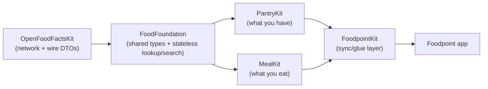

# Foodpoint — Package Architecture

**Status:** core decisions locked (2026-08-16).
**Companion documents:** [design-brief.md](design-brief.md) (current-state
audit), [meals-feature-design.md](meals-feature-design.md) (the feature this
split exists to support cleanly).

---

## 1. Why five packages

Today's `FoodpointKit` holds everything: models, mapping, and the single
`AppState` CRUD surface. Adding meals directly into it would work, but it
would make Pantry and Meal logic mutually entangled by default — anything
either one needs from the other becomes a same-file reach instead of a
deliberate dependency.

**The governing rule: treat PantryKit and MealKit as if they were separate
applications that happen to ship together today and might not tomorrow.**
Neither imports the other, neither shares mutable state with the other, and
neither is allowed to assume the other exists at runtime. The only thing
they're allowed to share is a common library underneath them — the same way
two unrelated apps might both link the same third-party SDK without knowing
about each other. That's what `FoodFoundation` is: a shared, stateless
library dependency, not a shared runtime. Where the two domains genuinely
need to affect one another (today, the one case is "eating a meal
decrements the pantry"), that wiring lives in `FoodpointKit` — the one
package explicitly allowed to know both exist, playing the role of the
integration layer between two products rather than a third peer.

A consequence worth stating plainly: this means some duplication is
**accepted, not a bug** — see §4.1.

## 2. Dependency graph



PantryKit and MealKit have **no edge between them** — not even a shared
cache. Anything that needs to cross that boundary lives in FoodpointKit
instead (§4.4).

## 3. Package responsibilities

### 3.1 OpenFoodFactsKit *(renamed from `OpenFoodFacts`)*

Unchanged in scope — `OpenFoodFactsService`, `FoodProduct`, `Nutriments`,
`OpenFoodFactsError`. Still knows nothing about domain types; still the only
package touching Open Food Facts' wire format.

**Mechanical rename:** `Package.swift` (`name:`/product/target), the
`XCLocalSwiftPackageReference`/`XCSwiftPackageProductDependency` entries in
`project.pbxproj`, the `relativePath`, and every `import OpenFoodFacts` →
`import OpenFoodFactsKit`. No behavior changes.

### 3.2 FoodFoundation *(new)*

The shared vocabulary every other package builds on — genuinely stateless.
No `@Observable` domain state, no singleton cache, nothing that would give
PantryKit and MealKit a back channel to each other. Plain types, pure
functions, and two network-touching entry points, both siblings free to call
independently since neither leaves a trace the other could observe.

Moves from today's `FoodpointKit`:
- `Product`, `Nutrition` (`scaled(by:)`, `isEffectivelyEmpty`, `isApproximatelyEqual`)
- `ProductUnit` / `UnitTrackingMode` — **the type only**: fields, `trackingMode`,
  `packageWeight`, `.make(...)`. Per-barcode variant management does not move
  here (§3.3).
- `NutritionVariant` / `NutritionSource` — same split: the type moves, its
  CRUD doesn't.
- `FoodCategory` / `Product.category`
- `NumericInput` (`String.localizedDouble`)
- `ProductMapping.swift`'s mapping inits (`Product.init(offProduct:)`,
  `Nutrition.init(offNutriments:)`)

`AppState.lookupProduct(barcode:)` was an extension on `AppState` because
that was the only place that needed it. Now that PantryKit and MealKit each
need to resolve a product independently — and, per §6, without a barcode at
all — it becomes a standalone, stateless namespace both call directly:

```swift
public enum ProductLookup {
    /// Resolve a known barcode — the existing scan flow.
    public static func fetch(barcode: String) async throws -> Product {
        let offProduct = try await OpenFoodFactsService.shared.fetchProduct(barcode: barcode)
        return Product(offProduct: offProduct)
    }

    /// Find candidates by name when there's no barcode to scan — see §6.
    public static func search(query: String) async throws -> [Product] {
        let offProducts = try await OpenFoodFactsService.shared.searchProducts(query: query)
        return offProducts.map(Product.init(offProduct:))
    }
}
```

Neither method writes anywhere. Each call is a fresh round trip to Open
Food Facts, mapped and handed back — exactly as `fetch` already behaves
today via `AppState.lookupProduct`. If PantryKit and MealKit each look up
the same barcode, they each get their own independently-fetched `Product`;
neither can see that the other did the same lookup, on purpose (§4.1).

### 3.3 PantryKit *(new — most of today's `AppState`)*

Depends only on FoodFoundation. Owns:
- `FoodItem`
- `PantryStore`, an `@Observable` class holding `items`, `unitConfigs`,
  `unitVariants`, `nutritionConfigs`, `nutritionVariants` — i.e. today's
  `AppState`, renamed because `AppState` now belongs to the composition root
  (§3.5)
- Every existing CRUD method: `addProduct`, `allVariants`/`addUnitVariant`/
  `updateVariant`/`removeVariant`/`makeDefault`, `renameUnitLabel`, the
  nutrition mirror, `setQuantity`, `removeItem` — unchanged logic, just
  calling `ProductLookup.fetch` instead of the old `AppState.lookupProduct`
  extension.

### 3.4 MealKit *(new, per meals-feature-design.md)*

Depends only on FoodFoundation — **not** PantryKit, not any shared cache.
Owns:
- `MealTemplate`, `MealEntry`, `TemplateIngredient`, `LoggedIngredient`,
  `MealSlot`, `MealStatus`
- `MealStore`, an `@Observable` class: template CRUD, entry CRUD/lifecycle
  (log, plan, tick off, undo), aggregation, consumption stats

**MealKit is self-sufficient for its own display needs.** Since there's no
shared catalog to fall back on, `TemplateIngredient` and `LoggedIngredient`
each snapshot the product identity they need to render themselves —
name, brand, and image URL alongside the existing `barcode`/nutrition
fields — captured at the moment the ingredient is added, not looked up
later from somewhere else. This is what lets MealKit's own "recently used"
history browse instantly, offline, and correctly even for a product that's
since vanished from the pantry entirely: it never had to ask PantryKit
where it went.

**MealKit acquires ingredients through FoodFoundation directly**, exactly
as a standalone app would: its own "scan a new ingredient" and "search for
an ingredient" sources (§6) call `ProductLookup.fetch`/`.search` themselves,
with no dependency on PantryKit's scan flow. The one ingredient source that
*is* genuinely cross-domain — "pick something already in my pantry" — can't
work this way, since it needs PantryKit's live data; that source is
composed one layer up, at the app/FoodpointKit level, which already holds
both stores (see meals-feature-design.md §6, updated).

`MealStore`'s tick-off/undo methods don't touch inventory themselves — they
transition state and hand back what changed (which ingredients, how much,
whether `usesFromPantry`) for the caller to act on. That handoff is what
lets MealKit stay decoupled — see §4.4.

### 3.5 FoodpointKit *(shrinks to a composition root)*

Depends on PantryKit and MealKit. Owns:
- `AppState`, an `@Observable` class holding `pantry: PantryStore` and
  `meals: MealStore`, still exposed as `AppState.shared` for
  `@Environment(AppState.self)` — the app's import surface doesn't change.
- Cross-domain orchestration — the one place allowed to know both domains
  exist. Concretely:

  ```swift
  extension AppState {
      public func markMealEaten(_ entryID: UUID) {
          guard let entry = meals.markEaten(entryID) else { return }
          for ingredient in entry.ingredients where ingredient.usesFromPantry {
              pantry.consume(barcode: ingredient.barcode, amount: ingredient.amount)
          }
      }
  }
  ```

**View call sites become explicit about which store they're touching:**
`appState.items` becomes `appState.pantry.items`; a new meals screen would
read `appState.meals.templates`. This is a real, mechanical, greppable
rename across every existing view — not forwarding properties on `AppState`
that re-declare the same surface twice. Forwarding would keep call sites
unchanged but means `AppState` re-exports its sub-stores' entire APIs,
which defeats a chunk of the point of separating them and adds boilerplate
this repo doesn't otherwise carry. Flag if you'd rather have the forwarding
version instead.

## 4. Consequences of the PantryKit/MealKit split worth naming explicitly

### 4.1 Product data is duplicated across domains, on purpose

`FoodItem` (PantryKit) and `LoggedIngredient`/`TemplateIngredient` (MealKit)
each keep their own copy of a product's name, brand, and nutrition, fetched
independently through their own calls to `ProductLookup`. If a product's
name changes on Open Food Facts, the pantry's copy and a meal's copy could
say different things until each is independently refreshed.

This is the direct, accepted cost of §1's "separate applications" rule —
the alternative (a shared cache or cross-package lookup) is exactly the
coupling this split exists to avoid. Two real separate apps built against
the same third-party data source would have the same property: each caches
what it fetched, and neither is obligated to notice when the other's copy
goes stale. For history in particular (§4.3 of meals-feature-design.md) a
frozen, possibly-stale snapshot is the *correct* behavior, not a defect.

### 4.2 Tests split along the same lines

`ProductUnitTests`, `NutritionTests`, `FoodCategoryTests`,
`NumericInputTests`, `ProductMappingTests` → `FoodFoundationTests`.
`AppStateTests` splits: pantry-specific cases → `PantryKitTests`; a much
smaller `FoodpointKitTests` covers only orchestration (e.g. "marking a meal
eaten decrements the right pantry item").

### 4.3 The undo edge case worth flagging now, solving during implementation

If ticking off a meal fully depletes an item (`PantryStore.setQuantity`
already deletes a `FoodItem` at zero), undo needs to *re-create* it, not
just add to a quantity — which needs enough information (a `Product`, a
`ProductUnit`) to do that, not just a barcode and an amount. `LoggedIngredient`
already snapshots what's needed (§4.3 of the meals design); `PantryStore`
just needs a "restore" entry point that can recreate an item rather than
only adjusting an existing one. Noting this here so it isn't a surprise
mid-implementation, not resolving the exact method shape now.

### 4.4 This is what "MealKit independent, FoodpointKit wires it" costs

Every future cross-domain feature (a shopping-list suggestion driven by
meal-planning + low stock, say) goes through FoodpointKit the same way.
That's the intended cost of keeping PantryKit and MealKit peers — it
concentrates coupling in one place instead of spreading it, at the price of
FoodpointKit being where that complexity accumulates over time.

## 5. Resolved: no shared catalog — each domain snapshots what it needs

The previous draft of this document proposed a shared `ProductCatalog`
singleton in FoodFoundation so meal history could survive a pantry item
being fully consumed. That's now rejected: a mutable cache both packages
read *is* a shared runtime dependency between them, exactly the thing §1
rules out, even if it lives in a package they both already depend on for
types.

The resolution is §3.4/§4.1: MealKit snapshots the product identity it
needs directly onto its own ingredient records at add-time, via its own
independent calls to `ProductLookup`. Nothing shared, nothing to keep in
sync, nothing that breaks if PantryKit's data model changes shape later.

## 6. New requirement: adding a product without scanning a barcode

Produce, bulk-bin goods, and plenty of generic groceries either have no
printed barcode or aren't worth digging out of a drawer to scan. Open Food
Facts still often has an entry for them — "banana," "yellow onion" — findable
by name even without a code to scan. This is a genuine second way to
identify a product, alongside scanning, and it belongs at the same layer as
scanning: FoodFoundation, so both PantryKit and MealKit get it for free.

### 6.1 What changes, concretely

- **OpenFoodFactsKit** gains a search call — `OpenFoodFactsService` needs a
  `searchProducts(query: String) async throws -> [FoodProduct]`, hitting
  Open Food Facts' text-search endpoint rather than its by-barcode lookup.
  (Confirm the exact endpoint/query shape against OFF's current API when
  implementing — the legacy and v2 search APIs differ in response shape;
  this doc doesn't commit to one.) Returns a list, since a name search is
  inherently ambiguous — "apple" matches many products — unlike a barcode
  fetch, which returns exactly one.
- **FoodFoundation** gains `ProductLookup.search(query:) async throws ->
  [Product]` (§3.2), mapping each result the same way `fetch` does.
- **Both PantryKit and MealKit gain a second acquisition path** alongside
  scanning, feeding the *same* downstream flow a scan result would: pick a
  product from search results, and everything past that point (unit setup,
  nutrition review, ingredient composition) is unchanged. No new model
  shape is needed — Open Food Facts assigns every product in its database
  a `code` (its `id` in this app) whether it was found by scanning or by
  search, so `Product`/`FoodItem`/`LoggedIngredient` don't need to change to
  support this.

### 6.2 What this doesn't solve

This is still entirely Open-Food-Facts-backed — it removes the *barcode*
requirement, not the *"Open Food Facts has to know about it"* requirement.
A genuinely home-cooked dish or a product with no OFF presence at all is
still out of reach; that's the separate, still-deferred "quick entry"
escape hatch from meals-feature-design.md §11, not this. Search meaningfully
narrows the gap for fresh produce specifically; it doesn't close it.

### 6.3 Where this shows up in each domain

- **PantryKit / the Scan tab:** a "Search by name" option alongside "Scan
  Food Barcode," feeding the same product-detail-then-unit-setup flow
  `ScannerView` already has. Not detailed further here — it's a
  same-shape, lower-risk sibling of an existing flow, not a new one.
- **MealKit:** a fourth ingredient source, alongside pantry/history/scan —
  see meals-feature-design.md §6 (updated) for the full source list and
  rationale.

## 7. Migration map

| Today | Moves to |
|---|---|
| `Sources/FoodpointKit/Models/Product.swift` | `Packages/FoodFoundation/Sources/FoodFoundation/Models/Product.swift` |
| `Sources/FoodpointKit/Models/ProductUnit.swift` | `Packages/FoodFoundation/.../Models/ProductUnit.swift` (type + `.make` only) |
| `Sources/FoodpointKit/Models/NutritionVariant.swift` | `Packages/FoodFoundation/.../Models/NutritionVariant.swift` |
| `Sources/FoodpointKit/Models/FoodCategory.swift` | `Packages/FoodFoundation/.../Models/FoodCategory.swift` |
| `Sources/FoodpointKit/Models/NumericInput.swift` | `Packages/FoodFoundation/.../Models/NumericInput.swift` |
| `Sources/FoodpointKit/ProductMapping.swift` | `Packages/FoodFoundation/.../ProductLookup.swift` (`fetch` + new `search`, §6) |
| `Sources/FoodpointKit/Models/FoodItem.swift` | `Packages/PantryKit/Sources/PantryKit/Models/FoodItem.swift` |
| `Sources/FoodpointKit/AppState.swift` | splits: pantry logic → `Packages/PantryKit/.../PantryStore.swift`; a much smaller composing `AppState` stays in `Packages/FoodpointKit/Sources/FoodpointKit/AppState.swift` |
| *(new)* | `Packages/MealKit/Sources/MealKit/Models/*.swift`, `MealStore.swift` |
| `Packages/OpenFoodFacts/` | renamed `Packages/OpenFoodFactsKit/`, plus new `searchProducts` (§6.1) |

## 8. Sequencing

This restructuring should happen **before** MealKit is built, not after —
it's cheaper to build meals directly into the final package shape than to
extract it later. It also replaces the "product catalog" prerequisite from
`meals-feature-design.md` §3.2, which no longer applies (§5); that
document's build order (§15) should be read as starting after this split
lands.

Suggested order:
1. Rename `OpenFoodFacts` → `OpenFoodFactsKit` (mechanical, low-risk, do it
   first to get it out of the way).
2. Extract `FoodFoundation` from `FoodpointKit`, including `ProductLookup`.
   `.fetch` is a straight move; `.search` (and `OpenFoodFactsService.searchProducts`,
   §6.1) can land in this same step or slightly after — it's additive and
   doesn't block anything downstream. Existing `FoodpointKit` temporarily
   depends on `FoodFoundation` and re-exports nothing new yet — app still
   builds unchanged.
3. Extract `PantryKit`: move `FoodItem` and the pantry slice of `AppState`
   into `PantryStore`. `FoodpointKit.AppState` becomes a thin wrapper holding
   `pantry: PantryStore` and forwarding nothing — this is the point where
   every view's `appState.items` etc. gets mechanically renamed to
   `appState.pantry.items`.
4. Add `MealKit` and wire it into `FoodpointKit.AppState` as `meals:
   MealStore`, per meals-feature-design.md's own build order from here on.

Steps 1–3 are pure refactor with no behavior change and full existing test
coverage to verify against at each step — a safe, mechanical foundation to
lay before any new meals code is written.
