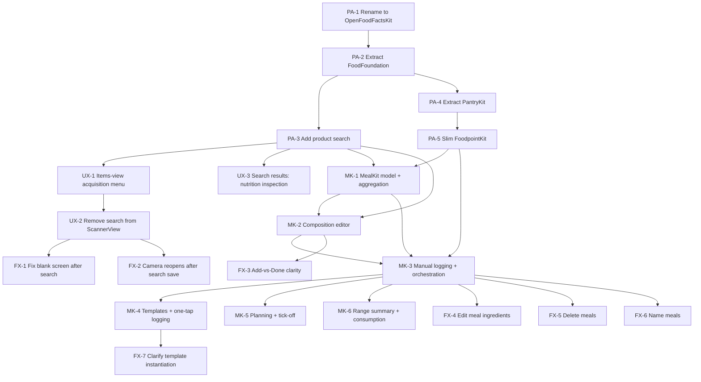

# Foodpoint — Task Board

Source design docs: [design-brief.md](../design-brief.md),
[meals-feature-design.md](../meals-feature-design.md),
[package-architecture.md](../package-architecture.md).

---

## How this works

Each task is one file under `epic-*/ID-slug.md`, with YAML frontmatter:

```yaml
id: PA-1
epic: package-architecture
title: ...
status: backlog | ready | in-progress | done
depends_on: [PA-...]
design_doc: package-architecture.md#anchor
```

- **backlog** — defined, but a dependency isn't done yet
- **ready** — every dependency is `done`; can be started
- **in-progress** — actively being worked
- **done** — meets its Definition of Done, committed

**A task is only "ready" once every ID in its `depends_on` is `done`.**
When you finish a task, flip its `status` to `done`, then re-check any
tasks that named it as a dependency — flip those to `ready` if everything
*they* depend on is now also done. This file's tables are the
human-readable summary of that same state; keep them in sync by hand when
a status changes (or ask Claude to do it — it can grep every file's
frontmatter and regenerate the tables below).

## Dependency graph



## Epic 1 — Package Architecture Restructuring

Prerequisite for meals; no new user-facing behavior. See
[package-architecture.md](../package-architecture.md).

| ID | Title | Status | Depends on |
|----|-------|--------|-----------|
| [PA-1](epic-1-package-architecture/PA-1-rename-openfoodfacts-kit.md) | Rename OpenFoodFacts → OpenFoodFactsKit | done | — |
| [PA-2](epic-1-package-architecture/PA-2-extract-food-foundation.md) | Extract FoodFoundation | done | PA-1 |
| [PA-3](epic-1-package-architecture/PA-3-add-product-search.md) | Add product search (no-barcode acquisition) | done | PA-2 |
| [PA-4](epic-1-package-architecture/PA-4-extract-pantry-kit.md) | Extract PantryKit | done | PA-2 |
| [PA-5](epic-1-package-architecture/PA-5-slim-foodpoint-kit.md) | Slim FoodpointKit to a composition root | done | PA-4 |

## Epic 2 — Search & Acquisition UX Refinement

Direct follow-up feedback on PA-3's UI placement, not a package-structure
change — no companion design doc, scoped straight from review. Search
moves out of `ScannerView` into a proper Items-view entry point, and the
results screen gains a way to inspect nutrition before picking a
candidate. Sequenced before Epic 3 (Meals) since MealKit's own ingredient
picker (MK-2) will reuse whatever `ProductSearchView` looks like after
this lands.

| ID | Title | Status | Depends on |
|----|-------|--------|-----------|
| [UX-1](epic-2-search-ux-refinement/UX-1-items-view-acquisition-menu.md) | Add an acquisition menu to ItemsView (scan or search) | done | PA-3 |
| [UX-2](epic-2-search-ux-refinement/UX-2-remove-search-from-scanner.md) | Remove the search entry point from ScannerView | done | UX-1 |
| [UX-3](epic-2-search-ux-refinement/UX-3-search-results-nutrition-inspection.md) | Let search results be inspected for nutrition before picking one | done | PA-3 |

## Epic 3 — Meals Feature

See [meals-feature-design.md](../meals-feature-design.md). Depends on
Epic 1 being fully done (PA-5) before it can start in earnest, though
MK-1 only strictly needs PA-5 + PA-3 — **not** Epic 2, though MK-2's
ingredient-search source will likely want to reuse Epic 2's reworked
`ProductSearchView`, so landing Epic 2 first avoids MK-2 building against
a UI that's about to change underneath it.

| ID | Title | Status | Depends on |
|----|-------|--------|-----------|
| [MK-1](epic-3-meals-feature/MK-1-mealkit-model-and-aggregation.md) | MealKit core model and aggregation | done | PA-5, PA-3 |
| [MK-2](epic-3-meals-feature/MK-2-meal-composition-editor.md) | Meal composition editor and ingredient acquisition | done | MK-1, PA-3 |
| [MK-3](epic-3-meals-feature/MK-3-manual-logging-and-orchestration.md) | Manual logging loop and pantry orchestration | done | MK-1, MK-2, PA-5 |
| [MK-4](epic-3-meals-feature/MK-4-templates-and-one-tap-logging.md) | Templates and one-tap logging | done | MK-3 |
| [MK-5](epic-3-meals-feature/MK-5-planning-and-tick-off.md) | Planning and tick-off | done | MK-3 |
| [MK-6](epic-3-meals-feature/MK-6-range-summary-and-consumption.md) | Range summary and consumption surfaces | done | MK-3 |

## Epic 4 — Post-Testing Fixes

Direct feedback from running the app on the physical device for the first
time, same spirit as Epic 2: no companion design doc, scoped straight from
what testing turned up. Two bugs in the search-acquisition flow Epic 2
built (`ItemsView` → `ProductSearchView` → `ScannerView` handoff), plus
five usability/functionality gaps in the Meals feature Epic 3 built —
editing/deleting/naming a meal, the composition editor's confusing
add-vs-finish buttons, and an unclear one-tap-template-log affordance.
Nothing here blocks anything else; all seven are independent of each
other, though FX-1/FX-2 touch the same handoff code and may be easiest to
fix together.

| ID | Title | Status | Depends on |
|----|-------|--------|-----------|
| [FX-1](epic-4-post-testing-fixes/FX-1-fix-blank-screen-after-search-acquisition.md) | Fix blank screen after adding a product via search | ready | UX-2 |
| [FX-2](epic-4-post-testing-fixes/FX-2-fix-camera-reopens-after-search-save.md) | Don't reopen the camera after saving a product added via search | ready | UX-2 |
| [FX-3](epic-4-post-testing-fixes/FX-3-composition-editor-add-vs-done-clarity.md) | Make "add another ingredient" vs "finish the meal" unambiguous | ready | MK-2 |
| [FX-4](epic-4-post-testing-fixes/FX-4-edit-meal-ingredients.md) | Let a meal's ingredients be edited after it's logged or planned | ready | MK-3 |
| [FX-5](epic-4-post-testing-fixes/FX-5-delete-meals.md) | Let a logged or planned meal be deleted | ready | MK-3 |
| [FX-6](epic-4-post-testing-fixes/FX-6-name-meals.md) | Let a meal be given a real name instead of a hardcoded placeholder | ready | MK-3 |
| [FX-7](epic-4-post-testing-fixes/FX-7-clarify-template-instantiation-affordance.md) | Make logging a template from the Templates list self-explanatory | ready | MK-4 |

## Bugs

Not epic-sequenced feature work — tracked separately as they're found.

| ID | Title | Status | Depends on |
|----|-------|--------|-----------|
| [BUG-1](bugs/BUG-1-first-input-field-hang.md) | Investigate first-use input-field hang (spike) | ready | — |

## What's next

**Epic 1 and Epic 2 are fully done.** UX-2/UX-3 landed on top of UX-1 —
`ScannerView` is scan-only again, `ItemsView` presents `ProductSearchView`
directly and hands a picked barcode back via a second sequenced sheet, and
search results gained a separate info-button push to a nutrition detail
view. A few things from Epic 1 still need confirming on the physical
device (build installed there): the full scan→save→adjust walkthrough
from PA-5, and tapping a search result through to a save from PA-3.

**Epic 3 is fully done**, meals-feature-design.md §2's bare-level scope met
in full: `MealKit` (a package with zero dependency on `PantryKit`), the
composition editor and its four ingredient sources, `FoodpointKit`'s
pantry-orchestration extension (`markMealEaten`/`undoMealEaten`,
`PantryStore.consume`/`restore`), a day-timeline Meals-tab home with
planning/tick-off, meal templates with one-tap logging and a "Remember
this meal?" promotion flow, and range-summary/consumption surfaces. All
four packages' test suites are green (162 tests total: MealKit 75,
FoodpointKit 20, PantryKit 31, FoodFoundation 36) and the app builds clean.
MK-3/MK-5/MK-6 had been left `in-progress` pending manual verification —
each session that tried had hit the same input-hang symptom **BUG-1** was
filed for while trying to get an ingredient into a composed meal — but the
app has since been run on the physical device and the core loops
(logging/undo, planning/tick-off, range summary) confirmed working there,
closing out all three.

**BUG-1 remains `ready`, unresolved as a root-cause investigation** — but
no longer blocking anything, since the physical device doesn't hit
whatever it was seeing in the Simulator sessions above. Its own spike
found no reproduction and attributed the earlier Simulator hangs to
testing-tooling artifacts; that same physical-device session did turn up a
**related** bug in the same general code area (**FX-1**, a
sequenced/stacked sheet handoff off `ItemsView`) — whether it shares a
root cause with BUG-1 is still open and worth settling, but it's tracked
as its own, narrower ticket under Epic 4 rather than folded into BUG-1's
broader "any input field, anywhere" scope.

**Epic 4 is new**, filed directly from that physical-device session: two
bugs in the search-acquisition flow Epic 2 built (blank screen after
adding via search, camera reopening after a search-originated save — both
traced to specific code in `ItemsView.swift`/`ScannerView.swift`, see
FX-1/FX-2), and five Meals-feature usability/functionality gaps (FX-3
through FX-7 — the composition editor's add-vs-finish button confusion,
missing edit/delete/naming for meals, and an unclear template-log
affordance). All seven are `ready` and independent of each other.
