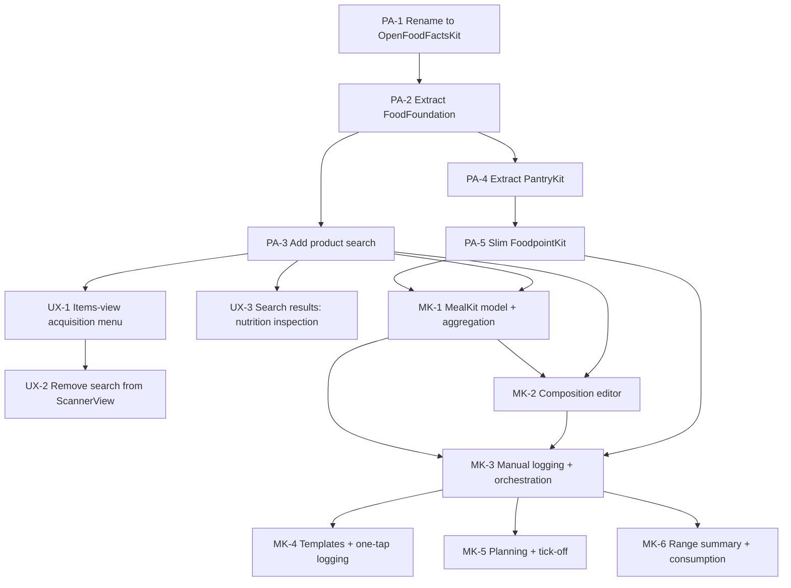

# Foodpoint — Task Board

Source design docs: [design-brief.md](../design-brief.md),
[meals-feature-design.md](../meals-feature-design.md),
[package-architecture.md](../package-architecture.md).

---

## How this works

Each task is one file under `epic-*/ID-slug.md`, with YAML frontmatter:

```yaml
id: PA-1
epic: package-architecture
title: ...
status: backlog | ready | in-progress | done
depends_on: [PA-...]
design_doc: package-architecture.md#anchor
```

- **backlog** — defined, but a dependency isn't done yet
- **ready** — every dependency is `done`; can be started
- **in-progress** — actively being worked
- **done** — meets its Definition of Done, committed

**A task is only "ready" once every ID in its `depends_on` is `done`.**
When you finish a task, flip its `status` to `done`, then re-check any
tasks that named it as a dependency — flip those to `ready` if everything
*they* depend on is now also done. This file's tables are the
human-readable summary of that same state; keep them in sync by hand when
a status changes (or ask Claude to do it — it can grep every file's
frontmatter and regenerate the tables below).

## Dependency graph



## Epic 1 — Package Architecture Restructuring

Prerequisite for meals; no new user-facing behavior. See
[package-architecture.md](../package-architecture.md).

| ID | Title | Status | Depends on |
|----|-------|--------|-----------|
| [PA-1](epic-1-package-architecture/PA-1-rename-openfoodfacts-kit.md) | Rename OpenFoodFacts → OpenFoodFactsKit | done | — |
| [PA-2](epic-1-package-architecture/PA-2-extract-food-foundation.md) | Extract FoodFoundation | done | PA-1 |
| [PA-3](epic-1-package-architecture/PA-3-add-product-search.md) | Add product search (no-barcode acquisition) | done | PA-2 |
| [PA-4](epic-1-package-architecture/PA-4-extract-pantry-kit.md) | Extract PantryKit | done | PA-2 |
| [PA-5](epic-1-package-architecture/PA-5-slim-foodpoint-kit.md) | Slim FoodpointKit to a composition root | done | PA-4 |

## Epic 2 — Search & Acquisition UX Refinement

Direct follow-up feedback on PA-3's UI placement, not a package-structure
change — no companion design doc, scoped straight from review. Search
moves out of `ScannerView` into a proper Items-view entry point, and the
results screen gains a way to inspect nutrition before picking a
candidate. Sequenced before Epic 3 (Meals) since MealKit's own ingredient
picker (MK-2) will reuse whatever `ProductSearchView` looks like after
this lands.

| ID | Title | Status | Depends on |
|----|-------|--------|-----------|
| [UX-1](epic-2-search-ux-refinement/UX-1-items-view-acquisition-menu.md) | Add an acquisition menu to ItemsView (scan or search) | done | PA-3 |
| [UX-2](epic-2-search-ux-refinement/UX-2-remove-search-from-scanner.md) | Remove the search entry point from ScannerView | ready | UX-1 |
| [UX-3](epic-2-search-ux-refinement/UX-3-search-results-nutrition-inspection.md) | Let search results be inspected for nutrition before picking one | ready | PA-3 |

## Epic 3 — Meals Feature

See [meals-feature-design.md](../meals-feature-design.md). Depends on
Epic 1 being fully done (PA-5) before it can start in earnest, though
MK-1 only strictly needs PA-5 + PA-3 — **not** Epic 2, though MK-2's
ingredient-search source will likely want to reuse Epic 2's reworked
`ProductSearchView`, so landing Epic 2 first avoids MK-2 building against
a UI that's about to change underneath it.

| ID | Title | Status | Depends on |
|----|-------|--------|-----------|
| [MK-1](epic-3-meals-feature/MK-1-mealkit-model-and-aggregation.md) | MealKit core model and aggregation | ready | PA-5, PA-3 |
| [MK-2](epic-3-meals-feature/MK-2-meal-composition-editor.md) | Meal composition editor and ingredient acquisition | backlog | MK-1, PA-3 |
| [MK-3](epic-3-meals-feature/MK-3-manual-logging-and-orchestration.md) | Manual logging loop and pantry orchestration | backlog | MK-1, MK-2, PA-5 |
| [MK-4](epic-3-meals-feature/MK-4-templates-and-one-tap-logging.md) | Templates and one-tap logging | backlog | MK-3 |
| [MK-5](epic-3-meals-feature/MK-5-planning-and-tick-off.md) | Planning and tick-off | backlog | MK-3 |
| [MK-6](epic-3-meals-feature/MK-6-range-summary-and-consumption.md) | Range summary and consumption surfaces | backlog | MK-3 |

## Bugs

Not epic-sequenced feature work — tracked separately as they're found.

| ID | Title | Status | Depends on |
|----|-------|--------|-----------|
| [BUG-1](bugs/BUG-1-first-input-field-hang.md) | Investigate first-use input-field hang (spike) | ready | — |

## What's next

**Epic 1 is fully done.** Two things from it still need confirming on the
physical device (both builds are installed there): the full
scan→save→adjust walkthrough from PA-5, and tapping a search result
through to a save from PA-3.

**UX-1 is done.** The Items-view "•••" menu now presents `ScannerView` as
a sheet via a new `EntryPoint` parameter, auto-opening scan or search with
no logic duplicated. Verified in Simulator up to (but not through) an
actual tap on the Cancel button or typed search query — both hit **BUG-1**
(see below), so the final click-through to a completed save still needs
confirming on the physical device, where the build is installed.

**UX-2 is now ready** (its one dependency, UX-1, is done). **UX-3** remains
ready and independent. MK-1 (Epic 3) is technically unblocked already, but
consider landing Epic 2 first — MK-2 will likely reuse `ProductSearchView`,
and building Meals against a search UI that's about to be reworked risks
redoing work.

**BUG-1 is new**, from a user report that independently matches an issue
Claude hit repeatedly while testing UX-1/PA-3 in the Simulator (previously
assumed to be Simulator-tooling-only) — worth investigating before it's
mistaken for "just how the Simulator behaves" again on a future task.
