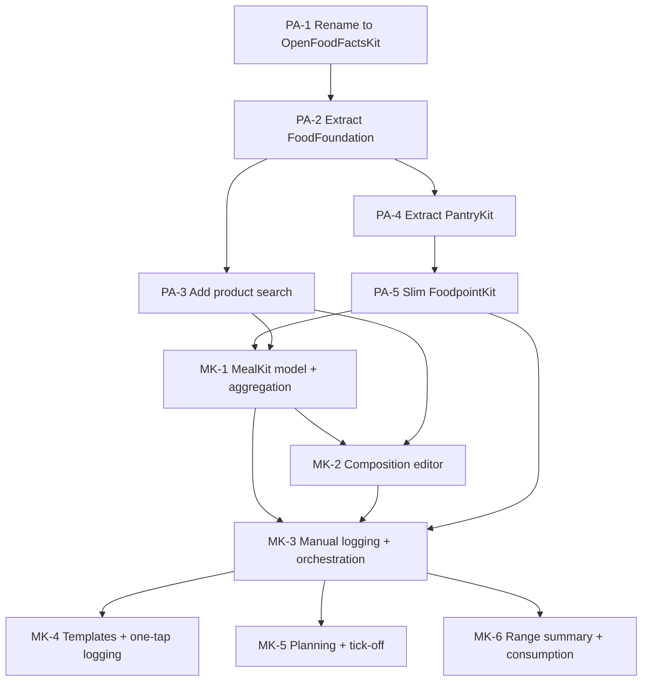

# Foodpoint — Task Board

Source design docs: [design-brief.md](../design-brief.md),
[meals-feature-design.md](../meals-feature-design.md),
[package-architecture.md](../package-architecture.md).

---

## How this works

Each task is one file under `epic-*/ID-slug.md`, with YAML frontmatter:

```yaml
id: PA-1
epic: package-architecture
title: ...
status: backlog | ready | in-progress | done
depends_on: [PA-...]
design_doc: package-architecture.md#anchor
```

- **backlog** — defined, but a dependency isn't done yet
- **ready** — every dependency is `done`; can be started
- **in-progress** — actively being worked
- **done** — meets its Definition of Done, committed

**A task is only "ready" once every ID in its `depends_on` is `done`.**
When you finish a task, flip its `status` to `done`, then re-check any
tasks that named it as a dependency — flip those to `ready` if everything
*they* depend on is now also done. This file's tables are the
human-readable summary of that same state; keep them in sync by hand when
a status changes (or ask Claude to do it — it can grep every file's
frontmatter and regenerate the tables below).

## Dependency graph



## Epic 1 — Package Architecture Restructuring

Prerequisite for meals; no new user-facing behavior. See
[package-architecture.md](../package-architecture.md).

| ID | Title | Status | Depends on |
|----|-------|--------|-----------|
| [PA-1](epic-1-package-architecture/PA-1-rename-openfoodfacts-kit.md) | Rename OpenFoodFacts → OpenFoodFactsKit | done | — |
| [PA-2](epic-1-package-architecture/PA-2-extract-food-foundation.md) | Extract FoodFoundation | done | PA-1 |
| [PA-3](epic-1-package-architecture/PA-3-add-product-search.md) | Add product search (no-barcode acquisition) | done | PA-2 |
| [PA-4](epic-1-package-architecture/PA-4-extract-pantry-kit.md) | Extract PantryKit | done | PA-2 |
| [PA-5](epic-1-package-architecture/PA-5-slim-foodpoint-kit.md) | Slim FoodpointKit to a composition root | done | PA-4 |

## Epic 2 — Meals Feature

See [meals-feature-design.md](../meals-feature-design.md). Depends on
Epic 1 being fully done (PA-5) before it can start in earnest, though
MK-1 only strictly needs PA-5 + PA-3.

| ID | Title | Status | Depends on |
|----|-------|--------|-----------|
| [MK-1](epic-2-meals-feature/MK-1-mealkit-model-and-aggregation.md) | MealKit core model and aggregation | ready | PA-5, PA-3 |
| [MK-2](epic-2-meals-feature/MK-2-meal-composition-editor.md) | Meal composition editor and ingredient acquisition | backlog | MK-1, PA-3 |
| [MK-3](epic-2-meals-feature/MK-3-manual-logging-and-orchestration.md) | Manual logging loop and pantry orchestration | backlog | MK-1, MK-2, PA-5 |
| [MK-4](epic-2-meals-feature/MK-4-templates-and-one-tap-logging.md) | Templates and one-tap logging | backlog | MK-3 |
| [MK-5](epic-2-meals-feature/MK-5-planning-and-tick-off.md) | Planning and tick-off | backlog | MK-3 |
| [MK-6](epic-2-meals-feature/MK-6-range-summary-and-consumption.md) | Range summary and consumption surfaces | backlog | MK-3 |

## What's next

**Epic 1 (Package Architecture Restructuring) is fully done.** The app
builds on the full `OpenFoodFactsKit → FoodFoundation → PantryKit →
FoodpointKit` split, plus the new search-a-licious-backed "Search by Name"
path (PA-3) alongside barcode scanning. Two things still need confirming
on the physical device (both builds are installed there): the full
scan→save→adjust walkthrough from PA-5, and tapping a search result
through to a save from PA-3 — the Simulator could verify search itself
against the live API, but not the tap-through, due to a Simulator input
issue unrelated to the app.

**MK-1 (MealKit core model and aggregation) is ready** — the first task of
Epic 2. Nothing else in Epic 2 can start before it; MK-2 depends on it
directly, and MK-3 through MK-6 all sit downstream of MK-2/MK-3.
